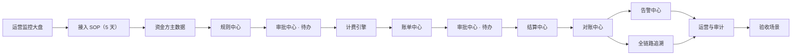
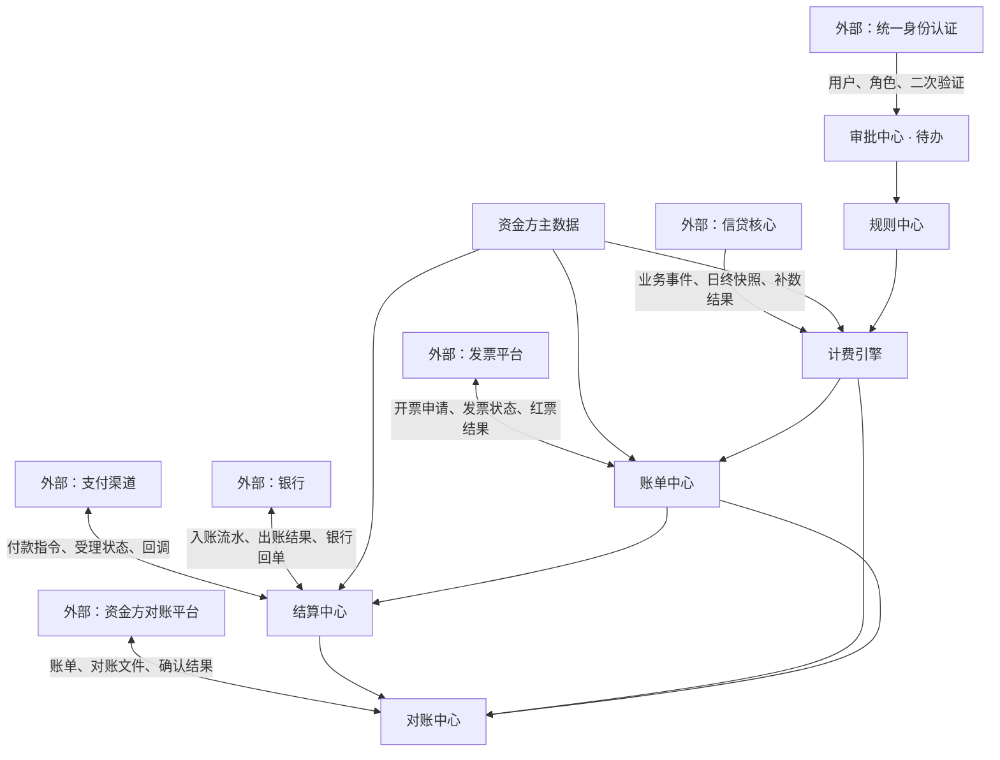
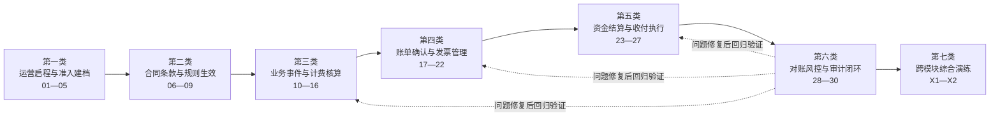
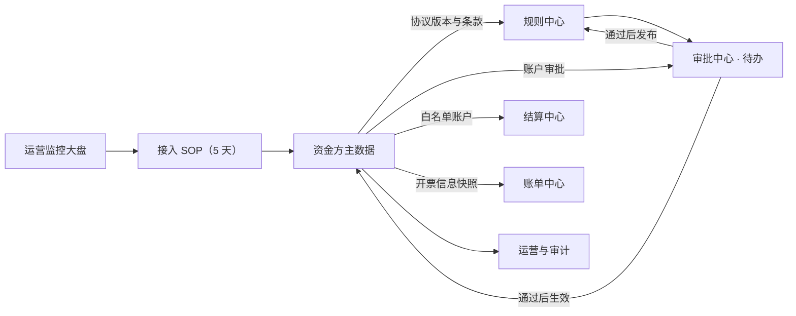
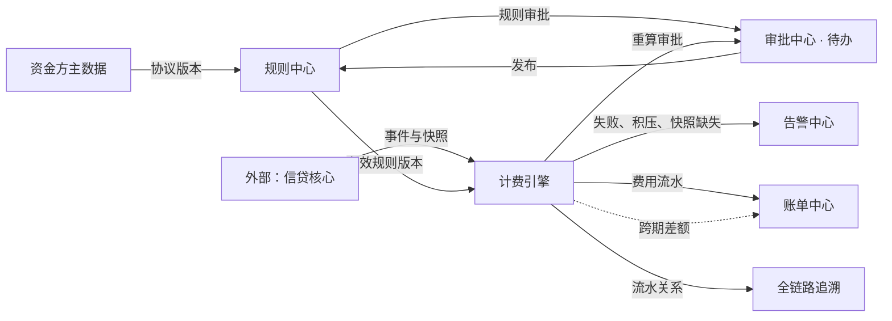
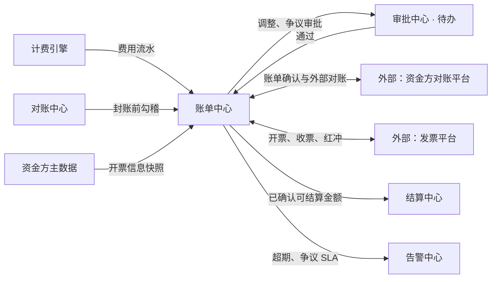
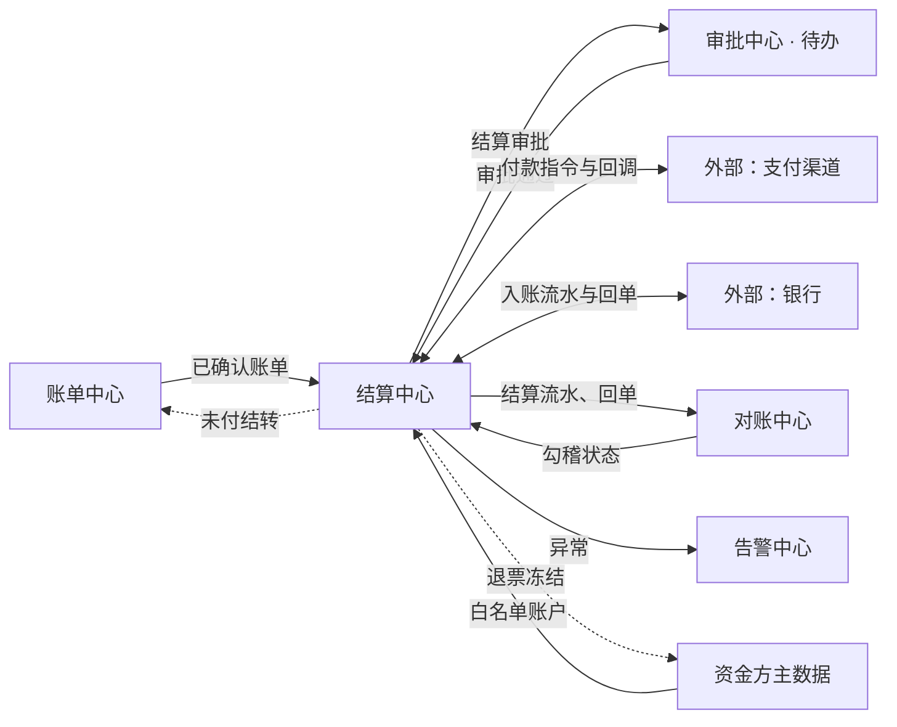
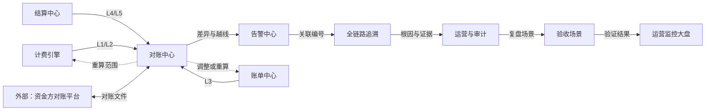
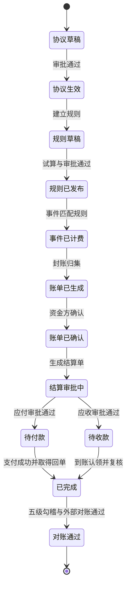
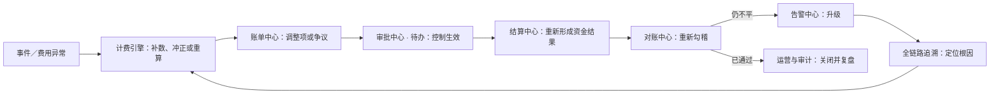

# 信贷资方结算系统：30 个标准业务流程、2 个综合演练、模块及应用集成关系

> 文档版本：V1.1  
> 编制日期：2026-09-17  
> 适用范围：当前前端原型工程 `retail-improved-prototype`  
> 阅读对象：产品、研发、测试、资金合作、财务核算、结算运营、风控、审计  
> 命名原则：本文所有内部模块名称均与原型左侧菜单 Tab 完全一致。

---

## 1. 文档目的

本文将原型覆盖的业务能力整理为 30 个标准端到端流程和 2 个跨模块综合演练，并按业务生命周期归入七类，回答以下问题：

1. 每个流程解决什么业务问题；
2. 流程由原型中的哪些模块承接；
3. 模块之间如何传递业务对象、状态、金额和证据；
4. 哪些环节与外部系统交互；
5. 每个流程有哪些关键控制点和最终产出。

系统的核心目标是让每一笔费用都能够沿以下链路完整追溯：

```text
资金方与协议 → 规则版本 → 业务事件 → 基数快照 → 费用流水
→ 账单 → 结算单 → 结算流水 → 银行回单 → 对账与审计证据
```

---

## 2. 原型左侧菜单与能力边界

原型左侧共 14 个菜单。协议、事件、发票等业务能力已归并到现有菜单中，不作为新的左侧模块名称出现。

| 原型左侧菜单 | 本文使用的模块能力 | 主要业务对象 |
|---|---|---|
| **运营监控大盘** | 大盘、个人待办、账期进度、资金进度、异常入口 | 账期、待办、指标、告警摘要 |
| **接入 SOP（5 天）** | 新资金方五天接入、交付物清单、阻断检查 | 接入任务、日程、交付物、检查项 |
| **验收场景** | 部分到账、部分争议、流水缺失等高风险场景演练 | 场景、预期结果、执行结果 |
| **资金方主数据** | 资金方、账户、开票信息、协议、结算条款、协议版本 | 资金方、账户、税务信息、协议、版本 |
| **规则中心** | 计费规则、试算、版本影响比对、发布 | 规则、费率模型、试算结果、规则版本 |
| **计费引擎** | 业务事件接入、幂等、补数、日度核算、基数快照、费用计算、费用流水、冲正、重算 | 事件、快照、费用流水、重算任务 |
| **账单中心** | 预出账、封账、账单、调整项、争议、开票、收票、红冲、出账日历 | 账单、调整项、争议单、发票申请 |
| **结算中心** | 结算单、轧差、付款指令、收款认领、银行回单、支付异常 | 结算单、支付指令、入账流水、回单 |
| **对账中心** | 五级勾稽、外部对账、差异处理、资损指标 | 勾稽批次、对账批次、差异单、指标 |
| **审批中心 · 待办** | 分级审批、双人复核、内容指纹、证据留存 | 审批单、审批节点、意见、证据包 |
| **告警中心** | P0—P3 风险告警、超时升级、关闭与重开 | 告警、处置记录、升级记录 |
| **全链路追溯** | 从任一编号向前、向后展开完整账务链 | 追溯节点、关联关系、规则快照 |
| **运营与审计** | 操作日志、变更记录、权限审计、运营指标 | 操作日志、变更前后快照、审计证据 |
| **设计决策 · 说明** | 业务边界、控制原则、外部集成说明 | 设计依据、模块边界、集成约束 |

### 2.1 概念能力到原型菜单的归并关系

| 概念能力 | 归属的原型菜单 |
|---|---|
| 主数据中心、协议中心 | **资金方主数据** |
| 事件中心、费用中心 | **计费引擎** |
| 发票中心、争议中心、调整项 | **账单中心** |
| 付款、收款、银行回单 | **结算中心** |
| 追溯与审计中心 | 分别由 **全链路追溯**、**运营与审计** 承接 |

---

## 3. 总体业务与应用集成关系

### 3.1 业务主链路



### 3.2 内外部系统关系



### 3.3 数据、状态和证据的传递原则

| 传递内容 | 上游 → 下游 | 约束 |
|---|---|---|
| 主数据 | **资金方主数据** → **规则中心**／**账单中心**／**结算中心** | 下游引用稳定编号和有效版本，不复制可变文本作为唯一依据 |
| 协议规则 | **资金方主数据** → **规则中心** → **计费引擎** | 生效后不可覆盖，只能新增版本；历史业务绑定历史版本 |
| 业务事实 | 信贷核心 → **计费引擎** | 事件必须有唯一幂等键、发生时间、资金方和业务对象 |
| 费用结果 | **计费引擎** → **账单中心** | 先生成原子费用流水，再按账期归集；原流水不得直接修改 |
| 账单结果 | **账单中心** → **结算中心** | 仅已确认且未被冻结的金额可进入结算 |
| 资金结果 | 支付渠道／银行 ↔ **结算中心** | 指令、结算流水和回单分层保存，未知状态不得直接重试 |
| 核对结果 | **计费引擎**／**账单中心**／**结算中心** → **对账中心** | 勾稽左右两侧独立取数，差异必须形成可跟踪单据 |
| 审批证据 | 各业务模块 ↔ **审批中心 · 待办** | 审批绑定内容版本和指纹；内容变化后原审批结论失效 |
| 风险证据 | 各模块 → **告警中心**／**全链路追溯**／**运营与审计** | 告警处置、追溯链路和操作日志共同构成审计证据 |

---

## 4. 流程业务分类与总览

### 4.1 七类业务流程

流程引导目录按业务生命周期组织。分类只改变学习与查找方式，不改变原有流程编号、参与模块、引导步骤和业务控制点。

| 类别 | 业务分类 | 流程范围 | 流程数 | 业务边界 |
|---|---|---|---:|---|
| 第一类 | **运营启程与准入建档** | 01—05 | 5 | 从每日运营优先级出发，完成新资金方接入、主体建档、账户复核和开票资料准备 |
| 第二类 | **合同条款与规则生效** | 06—09 | 4 | 把商务协议转化为可执行、可验证、经过审批且按版本生效的计费规则 |
| 第三类 | **业务事件与计费核算** | 10—16 | 7 | 接收业务事件并治理数据质量，完成基数快照、费用计算、流水查询、冲正和重算 |
| 第四类 | **账单确认与发票管理** | 17—22 | 6 | 从预账单检查和封账出账开始，完成账单确认、调整争议以及开票收票闭环 |
| 第五类 | **资金结算与收付执行** | 23—27 | 5 | 生成结算单并完成轧差与审批，按应付、应收方向执行付款、回单和收款认领 |
| 第六类 | **对账风控与审计闭环** | 28—30 | 3 | 通过内部勾稽和外部对账识别差异，联动告警、追溯、审计和验收完成风险闭环 |
| 第七类 | **跨模块综合演练** | X1—X2 | 2 | 以完整月结和资损异常为主线，串联多个模块进行端到端实战 |



原型中的“流程引导”弹窗与本表保持一致：默认展示七个分类分区，顶部可按分类筛选，也可按流程名称、模块或关键词搜索；选中具体流程后继续使用原有蒙版引导。

### 4.2 30 个标准流程总览

| 编号 | 流程名称 | 主责模块 | 主要协同模块 | 外部系统／对象 | 关键产出 |
|---:|---|---|---|---|---|
| 01 | 岗位登录与运营日启 | **运营监控大盘** | **审批中心 · 待办**、**告警中心** | 统一身份认证 | 个人待办、账期优先级 |
| 02 | 新资金方五天接入 SOP | **接入 SOP（5 天）** | **资金方主数据**、**规则中心**、**审批中心 · 待办** | 资金方资料 | 接入任务、上线结论 |
| 03 | 资金方主体准入与建档 | **资金方主数据** | **接入 SOP（5 天）**、**运营与审计** | 工商、合规资料 | 唯一资金方档案 |
| 04 | 银行账户新增、变更与双人复核 | **资金方主数据** | **审批中心 · 待办**、**结算中心** | 银行账户资料 | 白名单账户 |
| 05 | 开票信息维护 | **资金方主数据** | **账单中心**、**运营与审计** | 税务资料 | 有效开票抬头与税号 |
| 06 | 协议新签、条款拆解与版本变更 | **资金方主数据** | **规则中心**、**审批中心 · 待办** | 合作协议 | 协议版本、结算条款 |
| 07 | 计费规则配置 | **规则中心** | **资金方主数据** | 协议版本 | 规则草稿 |
| 08 | 规则试算与版本影响比对 | **规则中心** | **计费引擎** | 样例事件、历史事件 | 试算报告、影响清单 |
| 09 | 规则审批、发布与生效 | **规则中心** | **审批中心 · 待办**、**运营与审计** | 统一身份认证 | 生效规则版本 |
| 10 | 业务事件接入与幂等处理 | **计费引擎** | **告警中心** | 信贷核心 | 标准事件、幂等结果 |
| 11 | 事件完整性核对与补数 | **计费引擎** | **告警中心**、**账单中心** | 信贷核心 | 补齐事件、核对结果 |
| 12 | T+1 日度核算调度 | **计费引擎** | **运营监控大盘**、**告警中心** | 信贷核心 | 日度核算批次、异常清单 |
| 13 | 费用计算与基数快照 | **计费引擎** | **资金方主数据**、**规则中心** | 业务事件 | 基数快照、费用流水 |
| 14 | 费用流水查询与链路核验 | **计费引擎** | **全链路追溯** | 费用流水编号 | 计算明细、追溯关系 |
| 15 | 费用冲正 | **计费引擎** | **审批中心 · 待办**、**账单中心** | 原事件、原流水 | 反向流水、跨期调整项 |
| 16 | 范围重算与差额原子生效 | **计费引擎** | **规则中心**、**审批中心 · 待办**、**账单中心** | 重算范围 | 影子结果、差额流水 |
| 17 | 预出账预测与快照比对 | **账单中心** | **计费引擎**、**运营监控大盘** | 当前账期 | 预出账快照、落点区间 |
| 18 | 月末封账与正式账单生成 | **账单中心** | **计费引擎**、**对账中心**、**告警中心** | 账期 | 正式账单、封账记录 |
| 19 | 账单推送、确认与超期处理 | **账单中心** | **告警中心**、**结算中心** | 资金方对账平台 | 确认结果、超期处置 |
| 20 | 调整项申请与入账 | **账单中心** | **审批中心 · 待办**、**运营与审计** | 差异、冲正、重算结果 | 已审批调整项 |
| 21 | 账单争议核查与闭环 | **账单中心** | **规则中心**、**计费引擎**、**审批中心 · 待办** | 资金方反馈 | 核查包、争议结论 |
| 22 | 开票、收票与红冲 | **账单中心** | **资金方主数据**、**审批中心 · 待办** | 发票平台 | 发票申请、蓝票／红票 |
| 23 | 结算单生成与轧差 | **结算中心** | **账单中心**、**资金方主数据**、**对账中心** | 已确认账单 | 结算单、轧差明细 |
| 24 | 结算单分级审批 | **审批中心 · 待办** | **结算中心**、**运营与审计** | 统一身份认证 | 审批结论、证据包 |
| 25 | 应付付款指令、回调与回单 | **结算中心** | **对账中心**、**告警中心** | 支付渠道、银行 | 付款结果、结算流水、回单 |
| 26 | 付款异常处理 | **结算中心** | **告警中心**、**账单中心**、**资金方主数据**、**对账中心** | 支付渠道、银行 | 查询结果、补发、结转或退票处置 |
| 27 | 应收入账匹配、挂账认领与复核 | **结算中心** | **审批中心 · 待办**、**对账中心**、**告警中心** | 银行 | 收款核销、回单、挂账结论 |
| 28 | 五级勾稽与内部差异定位 | **对账中心** | **计费引擎**、**账单中心**、**结算中心**、**告警中心** | 内部五层数据 | 勾稽结果、内部差异单 |
| 29 | 外部文件对账与差异闭环 | **对账中心** | **账单中心**、**计费引擎**、**审批中心 · 待办** | 资金方对账平台 | 匹配结果、外部差异单 |
| 30 | 风险告警、全链路追溯、运营审计与验收复盘 | **告警中心** | **全链路追溯**、**运营与审计**、**验收场景**、**运营监控大盘** | 审计／运营人员 | 闭环证据、根因复盘、验收结果 |

### 4.3 跨模块综合演练

| 编号 | 演练名称 | 串联模块 | 完成标准 |
|---:|---|---|---|
| X1 | 完整月结闭环综合演练 | **运营监控大盘** → **计费引擎** → **账单中心** → **审批中心 · 待办** → **结算中心** → **对账中心** | 从账期检查连续完成核算、出账、审批、结算和五级勾稽 |
| X2 | 资损异常处理闭环综合演练 | **告警中心** → **全链路追溯** → **计费引擎**／**账单中心**／**结算中心** → **运营与审计** → **验收场景** | 从 P0／P1 告警出发完成定位、修复、指标验证、关闭、审计复盘和回归验收 |

---

## 5. 流程详细说明

## 5.1 接入与基础配置

### 流程 01：岗位登录与运营日启

- **业务目的**：让不同岗位在每天开始工作时，快速识别当前账期状态、风险级别和本人待办。
- **主责模块**：**运营监控大盘**。
- **协同模块**：**审批中心 · 待办**、**告警中心**。
- **输入**：统一身份、岗位角色、系统业务日、选定账期、未完成待办和活动告警。
- **处理步骤**：
  1. 统一身份认证返回用户及岗位角色；
  2. **运营监控大盘**按角色装载个人待办；
  3. 汇总账期进度、资金进度和风险指标；
  4. 按 P0／P1、阻断项、临期项、普通事项确定处理顺序；
  5. 用户从卡片直接进入对应业务模块。
- **关键控制**：发起、审批、复核和审计岗位分离；所有指标必须带账期和统计截至日。
- **输出**：当天的工作优先级、待办入口和风险处置清单。
- **模块关系**：**审批中心 · 待办**提供岗位任务，**告警中心**提供风险任务，**运营监控大盘**只做聚合和导流，不替代业务处理。

### 流程 02：新资金方五天接入 SOP

- **业务目的**：将主体准入、账户验证、协议签署、规则试算和上线检查压缩为可跟踪的五天标准流程。
- **主责模块**：**接入 SOP（5 天）**。
- **协同模块**：**资金方主数据**、**规则中心**、**审批中心 · 待办**、**运营与审计**。
- **输入**：合作意向、主体资料、银行账户、协议草案、计费样例和上线日期。
- **处理步骤**：
  1. D1 建立接入任务并完成主体准入；
  2. D2 完成协议条款拆解及三方会签；
  3. D3 建立规则并完成样例试算；
  4. D4 完成账户、规则和上线的分级审批；
  5. D5 发布规则、生成账期日历并开启首日监控。
- **关键控制**：每天都有强制交付物；任一阻断检查不通过不得推进；准入通过不代表可结算。
- **输出**：完成的接入任务、有效主数据、生效规则、上线检查结论。
- **模块关系**：**接入 SOP（5 天）**负责编排，实际档案落在**资金方主数据**，规则落在**规则中心**，高风险动作由**审批中心 · 待办**控制。

### 流程 03：资金方主体准入与建档

- **业务目的**：形成全系统唯一、稳定的资金方主体根数据。
- **主责模块**：**资金方主数据**。
- **协同模块**：**接入 SOP（5 天）**、**运营与审计**。
- **输入**：统一社会信用代码、机构类型、法人主体、合作角色、结算币种和合规材料。
- **处理步骤**：校验主体唯一性 → 录入主体资料 → 完成准入检查 → 分配资金方编号 → 设置合作状态。
- **关键控制**：统一社会信用代码和主体编号不得重复；暂停合作只限制新增业务，存量账务仍需闭环。
- **输出**：资金方档案、合作状态和变更记录。
- **模块关系**：该档案是**规则中心**、**计费引擎**、**账单中心**和**结算中心**共同引用的业务根对象。

### 流程 04：银行账户新增、变更与双人复核

- **业务目的**：确保收付款只能进入经过验证的白名单账户。
- **主责模块**：**资金方主数据**。
- **协同模块**：**审批中心 · 待办**、**结算中心**、**运营与审计**。
- **输入**：账户名、账号、开户行、币种、账户用途和证明材料。
- **处理步骤**：录入／变更账户 → 实时校验 → 提交审批 → 非发起人复核 → 加入白名单 → 向**结算中心**生效。
- **关键控制**：账户名必须与协议主体一致；发起人不得自复核；历史账户停用但不可删除；账户内容变化后原审批失效。
- **输出**：已复核白名单账户、审批记录和变更前后快照。
- **模块关系**：**结算中心**只读取已生效白名单；退票触发的账户冻结会反向回写**资金方主数据**。

### 流程 05：开票信息维护

- **业务目的**：为应收开票、应付收票和红冲提供准确税务信息。
- **主责模块**：**资金方主数据**。
- **协同模块**：**账单中心**、**运营与审计**。
- **输入**：抬头、税号、地址电话、开户行账号、税务身份和税收分类信息。
- **处理步骤**：维护信息 → 执行完整性校验 → 生效 → 在生成发票申请时由**账单中心**引用。
- **关键控制**：税号和抬头必填；变更保留历史版本；已开票单据继续保留当时快照。
- **输出**：有效开票信息及历史快照。
- **模块关系**：**账单中心**不直接维护税务主数据，只在开票申请中固化引用快照。

### 流程 06：协议新签、条款拆解与版本变更

- **业务目的**：把商务合同转成系统可执行的协议版本和结算条款。
- **主责模块**：**资金方主数据**。
- **协同模块**：**规则中心**、**审批中心 · 待办**、**运营与审计**。
- **输入**：协议正文、生效区间、费用项、计费方向、结算周期、出账日、税务约定、争议和超期策略。
- **处理步骤**：建立协议主档 → 拆解结算条款 → 建立版本 → 校验生效区间 → 提交审批 → 生效或等待生效。
- **关键控制**：版本区间左闭右开、不得重叠或留空洞；已生效版本不可覆盖；追溯生效必须明确影响范围。
- **输出**：协议主档、协议版本、结算条款及审批证据。
- **模块关系**：**规则中心**基于协议版本建立规则；**计费引擎**按业务发生日路由到对应版本。

### 接入与基础配置关系图



---

## 5.2 规则、事件与计费

### 流程 07：计费规则配置

- **业务目的**：将协议中的计费约定转为结构化、可执行的规则。
- **主责模块**：**规则中心**。
- **协同模块**：**资金方主数据**。
- **输入**：协议版本、触发事件、计费对象、基数、费率模型、方向、税率、最低／封顶金额和冲正机制。
- **处理步骤**：选择协议版本 → 选择模板或向导 → 配置五要素 → 校验字段和区间 → 保存规则草稿。
- **关键控制**：费率单位、应收／应付方向、阶梯边界、税率和生效区间必须明确。
- **输出**：待试算的规则版本草稿。
- **模块关系**：**资金方主数据**提供协议边界，**规则中心**负责把边界转为机器可执行条件。

### 流程 08：规则试算与版本影响比对

- **业务目的**：在发布前验证金额、边界和历史影响。
- **主责模块**：**规则中心**。
- **协同模块**：**计费引擎**。
- **输入**：规则草稿、标准样例事件、历史样本和旧规则版本。
- **处理步骤**：选择试算样例 → 调用与正式计费相同的内核 → 输出逐步计算过程 → 比较新旧版本 → 汇总影响金额和对象。
- **关键控制**：试算与正式计费必须共用内核；重点覆盖阶梯边界、日费率、保底封顶、跨版本和冲正场景。
- **输出**：试算报告、新旧版本差异、审批证据包。
- **模块关系**：**规则中心**管理试算任务和结果，**计费引擎**提供唯一计算能力，避免“两套公式”。

### 流程 09：规则审批、发布与生效

- **业务目的**：确保影响资金的规则经过分级审批后按指定日期生效。
- **主责模块**：**规则中心**。
- **协同模块**：**审批中心 · 待办**、**运营与审计**、**计费引擎**。
- **输入**：规则版本、试算报告、影响金额、风险标记和计划生效日。
- **处理步骤**：提交审批 → 自动生成审批链 → 逐级审批 → 固化内容指纹 → 发布 → 到达生效日后供计费路由。
- **关键控制**：发起人不得自批；业务内容变化必须重新审批；历史版本不可删除。
- **输出**：已发布规则版本、审批记录、发布时间和操作日志。
- **模块关系**：审批通过后，**规则中心**向**计费引擎**提供按发生日可路由的有效版本。

### 流程 10：业务事件接入与幂等处理

- **业务目的**：把信贷核心中的放款、还款、余额、逾期等业务事实稳定接入计费链路。
- **主责模块**：**计费引擎**。
- **协同模块**：**告警中心**。
- **外部系统**：信贷核心。
- **输入**：事件编号、事件类型、发生时间、资金方、借据、金额和业务状态。
- **处理步骤**：接收事件 → 格式与必填校验 → 标准化 → 幂等检查 → 路由规则 → 进入处理队列。
- **关键控制**：同一 `事件编号 + 计费项 + 规则版本` 只能形成一组有效费用结果；重复事件记录幂等命中而不重复计费。
- **输出**：标准事件、幂等结果、失败原因或待处理任务。
- **模块关系**：外部事实只进入**计费引擎**；异常积压或连续失败由**告警中心**升级。

### 流程 11：事件完整性核对与补数

- **业务目的**：发现上游漏推事件，并通过可重复执行的补数恢复完整性。
- **主责模块**：**计费引擎**。
- **协同模块**：**告警中心**、**账单中心**。
- **外部系统**：信贷核心。
- **输入**：按日期、资金方和事件类型汇总的上游笔数与本系统笔数。
- **处理步骤**：对比笔数 → 定位缺口 → 拉取范围全量 → 幂等过滤 → 补齐事件 → 自动计费 → 复核缺口归零。
- **关键控制**：补数可安全重跑；已封账账期的补数不得改写旧账单，应按跨期规则进入下期调整项。
- **输出**：补齐事件、补数批次、完整性核对结果和跨期调整项。
- **模块关系**：**计费引擎**补齐事实，跨期影响交给**账单中心**，超时缺口由**告警中心**持续跟踪。

### 流程 12：T+1 日度核算调度

- **业务目的**：每天提前完成事件、快照和费用核算，降低月末集中出账压力。
- **主责模块**：**计费引擎**。
- **协同模块**：**运营监控大盘**、**告警中心**。
- **外部系统**：信贷核心。
- **输入**：业务日、资金方范围、日终快照和当日事件。
- **处理步骤**：检查快照到齐 → 检查事件接入 → 执行规则路由 → 生成费用流水 → 运行异常规则 → 汇总日度结果 → 更新大盘。
- **关键控制**：缺少快照、事件积压、金额波动异常或冲正率越线时产生阻断或告警。
- **输出**：日度核算批次、日增费用、异常清单和账期进度。
- **模块关系**：**计费引擎**执行核算，**运营监控大盘**展示结果，**告警中心**承接异常闭环。

### 流程 13：费用计算与基数快照

- **业务目的**：根据发生日有效的协议和规则，把业务事实转换为可审计费用流水。
- **主责模块**：**计费引擎**。
- **协同模块**：**资金方主数据**、**规则中心**。
- **输入**：标准事件、协议版本、规则版本、计费基数和税率。
- **处理步骤**：按发生日路由协议 → 匹配规则 → 取得并固化基数 → 计算不含税金额 → 倒轧税额和含税金额 → 生成费用流水。
- **关键控制**：金额按分精度处理；含税金额＝不含税金额＋税额；规则、基数和计算过程全部固化快照。
- **输出**：基数快照、费用流水、规则快照和计算明细。
- **模块关系**：**资金方主数据**定义协议边界，**规则中心**提供算法配置，**计费引擎**形成最小账务单元。

### 流程 14：费用流水查询与链路核验

- **业务目的**：核实一笔费用如何产生，并为账单、争议和审计提供依据。
- **主责模块**：**计费引擎**。
- **协同模块**：**全链路追溯**。
- **输入**：费用流水号、事件编号、借据号或资金方。
- **处理步骤**：查询流水 → 展开事件、协议和规则 → 查看基数与逐步计算 → 查看所属账单和后续结算关系。
- **关键控制**：任何金额都必须能回到原始事件和规则快照；只有金额而无依据视为不可审计。
- **输出**：费用计算证据和上下游关联链。
- **模块关系**：**计费引擎**展示计算事实，**全链路追溯**负责跨模块向前和向后展开。

### 流程 15：费用冲正

- **业务目的**：用反向流水撤销全部或部分原费用，同时保留原始账务事实。
- **主责模块**：**计费引擎**。
- **协同模块**：**审批中心 · 待办**、**账单中心**、**运营与审计**。
- **输入**：原事件、原费用流水、冲正比例／金额、原因和发生日期。
- **处理步骤**：选择原流水 → 校验可冲正余额 → 生成冲正申请 → 审批 → 生成反向流水 → 判断同账期或跨账期落点。
- **关键控制**：不得修改原流水；累计冲正不得超过原金额；跨已封账账期通过调整项进入后续账期。
- **输出**：冲正流水、审批记录、跨期调整项和审计日志。
- **模块关系**：**计费引擎**生成反向事实，**账单中心**负责已封账后的跨期承接。

### 流程 16：范围重算与差额原子生效

- **业务目的**：当规则或数据修正影响一批费用时，先评估差异，再一次性安全生效。
- **主责模块**：**计费引擎**。
- **协同模块**：**规则中心**、**审批中心 · 待办**、**账单中心**、**运营与审计**。
- **输入**：资金方、时间区间、事件范围、目标规则版本和重算原因。
- **处理步骤**：建立重算任务 → 在影子区计算 → 与正式结果逐笔比较 → 汇总影响 → 提交审批 → 红冲旧结果并补记新结果 → 写入跨期调整。
- **关键控制**：审批前不得污染正式流水；生效过程要么全部成功，要么全部回滚；重算使用正式计费内核。
- **输出**：差异报告、审批证据、冲正／补记流水和调整项。
- **模块关系**：**规则中心**提供目标版本，**计费引擎**完成影子计算，**审批中心 · 待办**控制生效，**账单中心**承接跨期差额。

### 规则、事件与计费关系图



---

## 5.3 出账、账单、争议与发票

### 流程 17：预出账预测与快照比对

- **业务目的**：在账期结束前预测账单落点，提前发现缺数、规则和金额风险。
- **主责模块**：**账单中心**。
- **协同模块**：**计费引擎**、**运营监控大盘**。
- **输入**：当前账期费用流水、调整项、上期结转和历史同期数据。
- **处理步骤**：执行非封账检查 → 构造只读预账单 → 计算线性外推与同期比对区间 → 保存快照 → 与后续快照或正式账单比较。
- **关键控制**：预出账不占账单号、不绑定费用流水、不改变任何业务状态；账期末快照应与正式账单分文一致。
- **输出**：预出账快照、金额落点区间、阻断项和差额解释。
- **模块关系**：**计费引擎**提供实时费用，**账单中心**只读聚合，**运营监控大盘**展示预测风险。

### 流程 18：月末封账与正式账单生成

- **业务目的**：冻结账期事实，并按资金方、协议、方向和账期形成正式账单。
- **主责模块**：**账单中心**。
- **协同模块**：**计费引擎**、**对账中心**、**告警中心**。
- **输入**：终态事件、费用流水、调整项、上期结转、账期日历和前置检查结果。
- **处理步骤**：检查事件终态 → 检查快照和费用完整性 → 执行封账 → 按组合归集 → 校验价税恒等 → 生成正式账单。
- **关键控制**：存在未计费事件、缺失流水、勾稽不平或价税不恒等时阻断封账；正式账单生成后不可直接改写。
- **输出**：封账记录、正式账单、账单明细和阻断报告。
- **模块关系**：**计费引擎**提供原子流水，**对账中心**提供前置勾稽结论，**账单中心**完成归集。

### 流程 19：账单推送、确认与超期处理

- **业务目的**：取得资金方对账单的正式确认，并处理未按时反馈的情况。
- **主责模块**：**账单中心**。
- **协同模块**：**告警中心**、**结算中心**。
- **外部系统**：资金方对账平台。
- **输入**：正式账单、确认截止日和协议级超期策略。
- **处理步骤**：推送账单 → 等待反馈 → 登记确认／争议 → 到期检查 → 自动确认或继续 HOLD → 触发升级。
- **关键控制**：自动确认必须有协议依据；缺省策略为 HOLD；未确认金额不得进入结算。
- **输出**：确认记录、争议入口、超期处置和可结算金额。
- **模块关系**：**账单中心**把已确认无争议金额提供给**结算中心**；超期和拒绝确认由**告警中心**升级。

### 流程 20：调整项申请与入账

- **业务目的**：通过独立、可审批的调整项承接跨期冲正、重算差额和其他有依据的修正。
- **主责模块**：**账单中心**。
- **协同模块**：**审批中心 · 待办**、**运营与审计**。
- **输入**：来源单据、调整原因、金额、方向、目标账期和附件证据。
- **处理步骤**：创建调整项 → 关联来源 → 指定目标账期 → 提交审批 → 审批通过 → 纳入预出账和正式账单。
- **关键控制**：无来源、无原因或无审批不得入账；调整项不得直接改写历史账单。
- **输出**：已审批调整项、账期归属和变更日志。
- **模块关系**：**审批中心 · 待办**控制入账资格，**账单中心**在目标账期把调整项作为独立构成项归集。

### 流程 21：账单争议核查与闭环

- **业务目的**：对资金方提出的金额、费率、基数、重复计费、冲正等争议形成有证据的结论。
- **主责模块**：**账单中心**。
- **协同模块**：**规则中心**、**计费引擎**、**审批中心 · 待办**、**告警中心**。
- **输入**：争议账单、争议金额、争议类型、资金方说明和附件。
- **处理步骤**：登记争议 → 按类型自动拉取事件／基数／规则／流水 → 生成核查包 → 作出维持原账单、己方有误或需重算三类结论 → 资金方确认 → 闭环。
- **关键控制**：无核查包不得出结论；部分争议只冻结争议金额；T+3、T+5 按工作日升级。
- **输出**：争议结论、说明材料、调整项或重算任务。
- **模块关系**：**账单中心**管理争议状态，**规则中心**和**计费引擎**提供判定证据，需改账时进入调整或重算审批。

### 流程 22：开票、收票与红冲

- **业务目的**：完成应收开票、应付收票，以及账单变化后的红蓝票处理。
- **主责模块**：**账单中心**。
- **协同模块**：**资金方主数据**、**审批中心 · 待办**、**运营与审计**。
- **外部系统**：发票平台。
- **输入**：已确认账单、购销方信息、税率、税收分类编码和红冲原因。
- **处理步骤**：自动生成开票／收票任务 → 固化税务快照 → 前置校验 → 提交发票平台 → 接收状态 → 必要时申请红冲并生成后续蓝票。
- **关键控制**：购销方由收付方向决定；已开票账单不可直接作废；蓝票＋红票必须等于账单应结金额。
- **输出**：开票申请、发票状态、发票号码、红票和税务证据。
- **模块关系**：**资金方主数据**提供税务快照，**账单中心**管理票账关系，发票平台执行实际开具。

### 出账、账单与发票关系图



---

## 5.4 结算、付款与收款

### 流程 23：结算单生成与轧差

- **业务目的**：将已确认账单按结算边界归集为可执行的应收或应付结算单。
- **主责模块**：**结算中心**。
- **协同模块**：**账单中心**、**资金方主数据**、**对账中心**。
- **输入**：已确认账单、无争议金额、结算账户、计划结算日、币种和轧差条款。
- **处理步骤**：选择账期 → 按资金方／协议／账户／日期／币种分组 → 扣除冻结争议额 → 依据协议计算轧差 → 执行资金安全检查 → 生成结算单。
- **关键控制**：禁止跨账户、跨结算日、跨币种合并；轧差必须有协议依据；勾稽不平时不得生成。
- **输出**：应收／应付结算单、账单分摊和轧差计算明细。
- **模块关系**：**账单中心**提供可结算金额，**资金方主数据**提供账户，**对账中心**提供勾稽状态。

### 流程 24：结算单分级审批

- **业务目的**：按照金额和风险对结算指令进行岗位接力和证据审查。
- **主责模块**：**审批中心 · 待办**。
- **协同模块**：**结算中心**、**运营与审计**。
- **外部系统**：统一身份认证。
- **输入**：结算单、金额、方向、账户、风险检查结果、内容指纹和附件。
- **处理步骤**：提交审批 → 自动分级 → 逐级查看证据 → 二次身份验证 → 通过或驳回 → 回写结算单状态。
- **关键控制**：发起人不得自批；审批对象是固化版本；账户、金额或分摊变化后必须重新发起。
- **输出**：审批结论、审批轨迹、身份凭证和证据包。
- **模块关系**：**结算中心**拥有业务单据，**审批中心 · 待办**拥有审批过程，**运营与审计**保存长期证据。

### 流程 25：应付付款指令、回调与回单

- **业务目的**：执行平台向资金方的付款，并取得可用于勾稽的银行凭据。
- **主责模块**：**结算中心**。
- **协同模块**：**对账中心**、**告警中心**。
- **外部系统**：支付渠道、银行。
- **输入**：审批通过的应付结算单、白名单收款账户和支付通道路由。
- **处理步骤**：拆分支付指令 → 下发支付渠道 → 接收受理状态 → 接收最终回调 → 生成结算流水 → 获取银行回单 → 更新账单和结算单。
- **关键控制**：支付请求必须幂等；受理成功不等于资金成功；结算流水和回单金额必须一致。
- **输出**：付款指令、支付结果、结算流水、银行回单和完成状态。
- **模块关系**：**结算中心**执行资金动作，**对账中心**独立核验结算流水与回单，异常推送**告警中心**。

### 流程 26：付款异常处理

- **业务目的**：安全处理状态未知、部分成功和退票，避免重复付款或账实不符。
- **主责模块**：**结算中心**。
- **协同模块**：**告警中心**、**账单中心**、**资金方主数据**、**对账中心**。
- **外部系统**：支付渠道、银行。
- **输入**：异常支付指令、查询结果、成功／失败明细、退票流水和原因。
- **处理步骤**：
  1. 状态未知：按 30 秒、2 分钟、10 分钟、30 分钟主动查询；超 2 小时转 UNKNOWN 并产生 P0；
  2. 部分成功：对失败项生成补发指令，同时把本期未付金额结转下期；
  3. 退票：结算流水置退票，账单回退并解绑，冻结账户，完成账户变更后再重新结算。
- **关键控制**：UNKNOWN 状态禁止直接重试；补发保持原结算单和续号关系；退票账户必须移出白名单。
- **输出**：查询记录、人工确认、补发指令、下期结转、退票记录和账户冻结结果。
- **模块关系**：**结算中心**处置资金状态，**账单中心**承接未付结转，**资金方主数据**承接账户冻结，**告警中心**负责高风险升级。

### 流程 27：应收入账匹配、挂账认领与复核

- **业务目的**：把银行入账流水准确核销到待收款结算单，并处理无法自动匹配的来款。
- **主责模块**：**结算中心**。
- **协同模块**：**审批中心 · 待办**、**对账中心**、**告警中心**。
- **外部系统**：银行。
- **输入**：银行入账流水、付款账户、备注、金额和待收款结算单。
- **处理步骤**：依次执行备注含结算单号、账户＋金额精确、金额容差、多笔组合四级匹配 → 自动命中或进入挂账 → 人工认领／非本系统款项／原路退回 → 非认领人复核 → 核销并生成结算流水和回单。
- **关键控制**：认领人不得自复核；部分到账只按实收核销，剩余金额继续待收；不明来款不得强行匹配；挂账超过三个工作日升级。
- **输出**：收款核销、结算流水、银行回单、剩余应收或挂账终态。
- **模块关系**：银行提供入账事实，**结算中心**完成匹配和核销，**审批中心 · 待办**承接复核，**对账中心**完成 L4→L5 勾稽。

### 结算、付款与收款关系图



---

## 5.5 对账、差异与风险闭环

### 流程 28：五级勾稽与内部差异定位

- **业务目的**：验证业务事件、费用流水、账单、结算流水和银行回单五层数据是否完整一致。
- **主责模块**：**对账中心**。
- **协同模块**：**计费引擎**、**账单中心**、**结算中心**、**告警中心**。
- **输入**：选定账期的五层数据和状态。
- **处理步骤**：独立汇总 L1 业务事件 → L2 费用流水 → L3 账单 → L4 结算流水 → L5 银行回单 → 计算等式和状态一致性 → 对不平项逐层定位 → 生成差异单。
- **关键控制**：左右两侧必须独立取数；金额一致和状态一致同时满足才算通过；不平项阻断后续关键动作。
- **输出**：勾稽批次、A—N 等式结果、差异金额和内部差异单。
- **模块关系**：三个业务模块分别提供独立层级数据，**对账中心**只核对不改写来源，风险由**告警中心**升级。

### 流程 29：外部文件对账与差异闭环

- **业务目的**：与资金方逐笔核对费用和账单，并将差异转为可追踪的处理闭环。
- **主责模块**：**对账中心**。
- **协同模块**：**账单中心**、**计费引擎**、**审批中心 · 待办**、**告警中心**。
- **外部系统**：资金方对账平台。
- **输入**：我方明细文件、资金方回传文件、容差规则和月度容差阈值。
- **处理步骤**：导出我方 CSV → 接收资金方文件 → 校验文件及合计行 → 优先按费用流水号匹配 → 以借据号＋计费项兜底 → 分类一致／容差／金额不符／己方多／对方多 → 生成差异单 → 自动定位 → 调整、重算或说明 → 复核关闭。
- **关键控制**：0.05 元以内可自动核销，但月度累计超过阈值要复核；差异单必须包含原因、责任、处理和复核四要素。
- **输出**：匹配率、差异率、差异单、核查包和闭环结论。
- **模块关系**：**对账中心**编排外部交换和差异状态；金额修正回到**账单中心**或**计费引擎**，高风险生效由**审批中心 · 待办**控制。

### 流程 30：风险告警、全链路追溯、运营审计与验收复盘

- **业务目的**：把异常从“发现”推进到“处理、验证、关闭和复盘”，并保留可审计证据。
- **主责模块**：**告警中心**。
- **协同模块**：**全链路追溯**、**运营与审计**、**验收场景**、**运营监控大盘**。
- **输入**：勾稽不平、事件积压、冲正率、差异老化、结算失败率、回单缺失、操作日志和验收场景。
- **处理步骤**：指标扫描 → 按 P0—P3 生成或去重告警 → 从告警进入关联单据 → 用**全链路追溯**定位根因 → 修复业务 → 验证指标回落 → 填写处置方式和证据 → 关闭／重开 → 在**运营与审计**复盘 → 用**验收场景**复现高风险边界。
- **关键控制**：P0 不得“暂不处理”；指标未回落不得标记“已修复”；P0／P1 必须逐条关闭；操作、审批、变更和告警证据不可缺失。
- **输出**：告警闭环记录、完整追溯树、操作与变更证据、复盘结论和验收结果。
- **模块关系**：**告警中心**管理风险生命周期，**全链路追溯**提供跨模块事实，**运营与审计**保存责任和证据，**验收场景**验证同类问题不再发生，**运营监控大盘**展示最终风险状态。

### 对账、风险与审计关系图



---

## 6. 模块间应用集成关系矩阵

| 来源模块／系统 | 目标模块／系统 | 传递内容 | 交互方式 | 失败处理 |
|---|---|---|---|---|
| 统一身份认证 | **运营监控大盘** | 用户、角色、会话 | 登录／会话校验 | 禁止进入或回退登录 |
| 统一身份认证 | **审批中心 · 待办** | 身份、岗位、二次验证结果 | 实时认证 | 审批阻断并记录失败 |
| **接入 SOP（5 天）** | **资金方主数据** | 主体、账户、协议待办 | 页面导流＋任务关联 | 阻断接入任务推进 |
| **资金方主数据** | **规则中心** | 资金方、协议版本、结算条款 | 版本引用 | 无有效协议不得建规则 |
| **资金方主数据** | **账单中心** | 开票信息、税务快照 | 生成账单／发票时读取 | 开票前置校验失败 |
| **资金方主数据** | **结算中心** | 白名单账户、币种、账户状态 | 结算前实时校验 | FC-01 阻断结算 |
| **规则中心** | **审批中心 · 待办** | 规则版本、试算报告、影响金额 | 审批单 | 驳回后退回草稿 |
| **规则中心** | **计费引擎** | 生效规则和版本区间 | 按发生日读取 | 无可用版本则事件失败 |
| 信贷核心 | **计费引擎** | 事件、日终快照、补数数据 | 接口／批次模拟 | 重试、补数、告警 |
| **计费引擎** | **账单中心** | 费用流水、冲正和重算差额 | 账期归集 | 非终态或缺失时阻断封账 |
| **账单中心** | 资金方对账平台 | 账单、确认请求、对账文件 | 文件／接口模拟 | 超时、争议和告警 |
| **账单中心** | 发票平台 | 开票申请、红冲申请 | 接口模拟 | 失败可更正后重提 |
| **账单中心** | **结算中心** | 已确认可结算金额 | 结算单生成 | 未确认或冻结金额不进入 |
| **结算中心** | **审批中心 · 待办** | 结算单、账户、金额、证据 | 分级审批 | 驳回后回退业务状态 |
| **结算中心** | 支付渠道 | 付款指令、查询请求 | 幂等接口模拟 | 主动查询、禁止盲重试 |
| 支付渠道 | **结算中心** | 受理和最终状态 | 回调／主动查询 | UNKNOWN 进入 P0 |
| 银行 | **结算中心** | 入账流水、回单、退票 | 文件／接口模拟 | 挂账、人工认领、退票处置 |
| **计费引擎** | **对账中心** | 事件和费用层数据 | 独立汇总读取 | 生成差异单 |
| **账单中心** | **对账中心** | 账单层数据 | 独立汇总读取 | 生成差异单 |
| **结算中心** | **对账中心** | 结算流水和回单层数据 | 独立汇总读取 | 阻断并产生告警 |
| **对账中心** | **告警中心** | 越线指标和差异风险 | 指标扫描 | 去重、升级、关闭与重开 |
| 任一业务模块 | **全链路追溯** | 业务编号和关联关系 | 关联查询 | 标记断链节点 |
| 任一写操作模块 | **运营与审计** | 用户、角色、时间、前后值和依据 | 同步留痕 | 业务动作不得无日志完成 |

---

## 7. 关键业务对象状态关系

### 7.1 从配置到资金闭环



### 7.2 异常回路



---

## 8. 职责边界和控制原则

1. **运营监控大盘**只聚合和导流，不在大盘内绕过业务模块直接修改账务。
2. **资金方主数据**保存主体、账户、税务和协议事实；已生效版本只能通过新版本变更。
3. **规则中心**管理规则生命周期；计算由**计费引擎**统一执行，试算和正式计费共用内核。
4. **计费引擎**只生成原子费用事实；账单归集由**账单中心**完成。
5. **账单中心**冻结账期归集结果；账单确认后，修正必须通过争议、调整、冲正或重算流程。
6. **结算中心**管理真实资金动作；状态未知时先查询，严禁盲目重试。
7. **审批中心 · 待办**保存独立审批实体和内容指纹，业务模块只接收审批结果。
8. **对账中心**独立取数、独立判断，不直接篡改业务来源数据。
9. **告警中心**管理风险生命周期；关闭必须有处理方式、说明和验证结果。
10. **全链路追溯**提供事实关系，**运营与审计**保存操作责任，**验收场景**验证问题是否真正修复。

---

## 9. 新人使用建议

建议打开右上角“流程引导”，按照七类业务生命周期依次学习：

1. **第一类 · 运营启程与准入建档**：理解账期、岗位待办和风险优先级，完成一次新资金方接入以及主体、账户和开票信息建档；
2. **第二类 · 合同条款与规则生效**：维护协议版本，并完成规则配置、试算、审批和发布；
3. **第三类 · 业务事件与计费核算**：观察事件、补数、基数、费用流水、冲正和重算；
4. **第四类 · 账单确认与发票管理**：完成预出账、封账、确认、争议、调整以及发票处理；
5. **第五类 · 资金结算与收付执行**：分别演练应付付款、支付异常和应收入账认领；
6. **第六类 · 对账风控与审计闭环**：执行五级勾稽和外部对账，并在**告警中心**、**全链路追溯**、**运营与审计**完成异常闭环；
7. **第七类 · 跨模块综合演练**：完成一次完整月结和一次资损异常处理，最后进入**验收场景**验证修复结果。

新人能够独立完成“资金方接入、规则发布、事件计费、月结出账、结算审批、付款或到账认领、差异定位、告警关闭和全链路追溯”，即可认为掌握了系统完整业务闭环。

---

## 10. 文档依据

本文依据以下工程内容整理：

- 原型左侧菜单及能力提示配置；
- 原型全流程新手引导；
- 原型按七类业务生命周期组织的 30 个标准流程引导和 2 个跨模块综合演练；
- 资金方主数据、规则、计费、账单、结算、审批、对账、告警、追溯和审计页面；
- 原型中的事件补数、预出账、争议、发票、收款认领、支付异常和资损监控逻辑；
- 工程内产品设计文档与详细 PRD。
